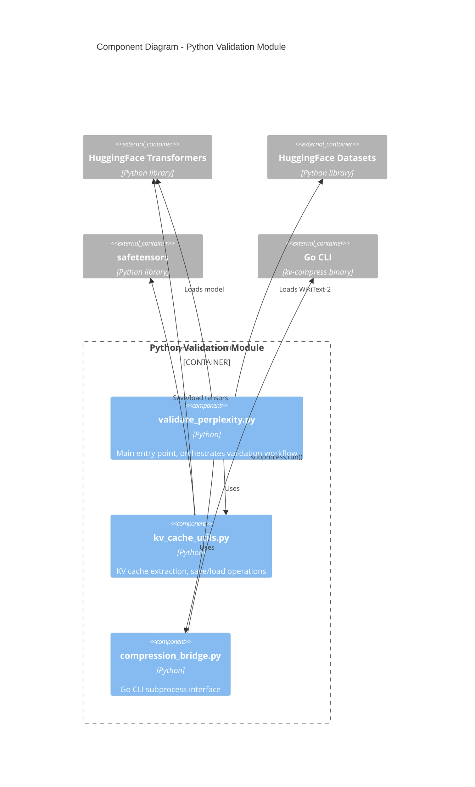
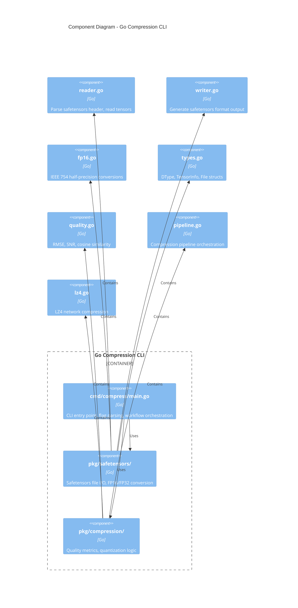

# C4 Component Diagram: TinyLLaMA Perplexity Validation System

## Overview
Detailed breakdown of the Python and Go components, showing internal structure and dependencies.

## Python Validation Module Components

## Go Compression CLI Components

## Python Components

| Component | Responsibility | Key Functions |
|-----------|---------------|---------------|
| validate_perplexity.py | Main orchestration | `run_full_validation()`, `compute_perplexity()`, `load_model_and_tokenizer()` |
| kv_cache_utils.py | KV cache operations | `extract_kv_cache()`, `save_kv_cache()`, `load_kv_cache()`, `validate_kv_cache_shape()` |
| compression_bridge.py | Go CLI interface | `compress_kv_cache()`, `decompress_kv_cache()`, `find_cli_binary()` |

## Go Components

| Component | Responsibility | Key Functions |
|-----------|---------------|---------------|
| cmd/compress/main.go | CLI interface | `main()`, `runCompress()`, `runDecompress()`, `simulateINT4Quantization()` |
| pkg/safetensors/reader.go | File parsing | `ReadFile()`, `Read()`, `bytesToFloat32()` |
| pkg/safetensors/writer.go | File generation | `WriteFile()`, `Write()`, `WriteFloat32Tensors()` |
| pkg/safetensors/fp16.go | FP16 conversion | `FP16ToFloat32()`, `Float32ToFP16()`, `BF16ToFloat32()` |
| pkg/compression/quality.go | Quality metrics | `ComputeTensorMetrics()`, `ValidateMetrics()`, `GetQualityLevel()` |
