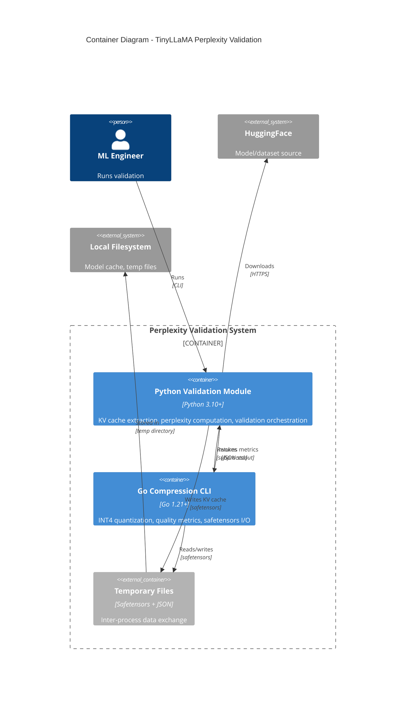

# C4 Container Diagram: TinyLLaMA Perplexity Validation System

## Overview
The system consists of two main containers: a Python validation module for ML operations and a Go CLI for compression operations. They communicate via safetensors files and JSON output.

## Diagram



## Containers

| Container | Technology | Purpose | Scaling |
|-----------|------------|---------|---------|
| Python Validation Module | Python 3.10+, PyTorch, Transformers | ML inference, KV cache extraction, perplexity | Single process, GPU optional |
| Go Compression CLI | Go 1.21+, safetensors lib | INT4 quantization, quality metrics | Single process, CPU-bound |
| Temporary Files | Safetensors format | Binary tensor exchange | Limited by disk I/O |

## Communication Flow

```
Python                    Files                      Go CLI
  |                         |                          |
  |-- save_kv_cache() ----->| kv_cache.safetensors     |
  |                         |                          |
  |-- subprocess.run() --------------------------->   |
  |                         |                          |
  |                         |<---- ReadFile() --------|
  |                         |                          |
  |                         |     [Quantize/Decompress]|
  |                         |                          |
  |                         |<---- WriteFile() -------|
  |                         | compressed.safetensors   |
  |                         |                          |
  |<----------------------- JSON metrics -------------|
  |                         |                          |
  |-- load_kv_cache() <-----|                          |
```

## Technology Choices

| Aspect | Choice | Rationale |
|--------|--------|-----------|
| Inter-process format | Safetensors | HuggingFace standard, safe (no pickle), efficient |
| CLI invocation | subprocess.run() | Simple, no CGO complexity |
| Metrics format | JSON stdout | Easy parsing, human-readable |
| Temp file location | tempfile.TemporaryDirectory | Auto-cleanup, cross-platform |
