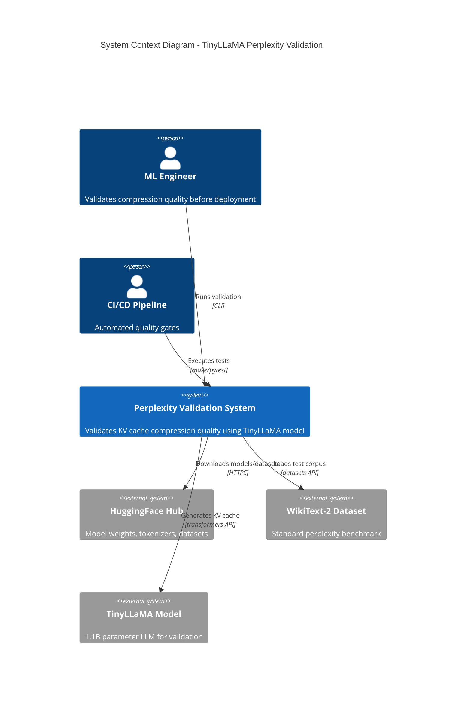

# C4 Context Diagram: TinyLLaMA Perplexity Validation System

## Overview
The TinyLLaMA Perplexity Validation System validates that INT4 compression of KV cache maintains inference quality. It bridges the Python ML ecosystem with Go compression pipelines, measuring perplexity delta against the KVQuant threshold of < 0.5.

## Diagram

## Actors

| Actor | Description | Interactions |
|-------|-------------|--------------|
| ML Engineer | Developer validating compression before deployment | Runs `python validate_perplexity.py` to check quality metrics |
| CI/CD Pipeline | Automated testing system | Executes `pytest` and `go test` for quality gates |

## External Systems

| System | Purpose | Integration |
|--------|---------|-------------|
| HuggingFace Hub | Model registry and dataset hosting | Python `transformers` and `datasets` libraries |
| WikiText-2 | Standard perplexity benchmark dataset | Loaded via `datasets.load_dataset()` |
| TinyLLaMA | Reference model for validation (1.1B params, GQA) | Loaded via `AutoModelForCausalLM.from_pretrained()` |

## Key Constraints

- TinyLLaMA uses Grouped Query Attention (GQA): 4 KV heads, not 32
- WikiText-2 perplexity requires stride=512 for accurate measurement
- Perplexity delta threshold: < 0.5 per KVQuant standard
