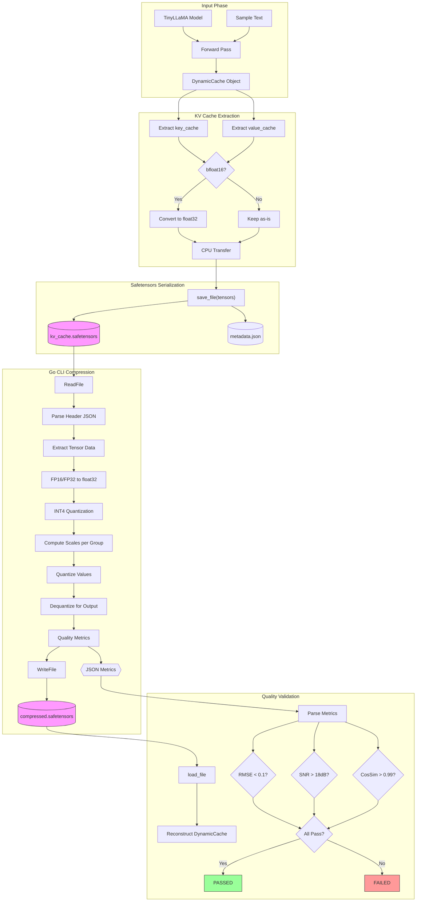
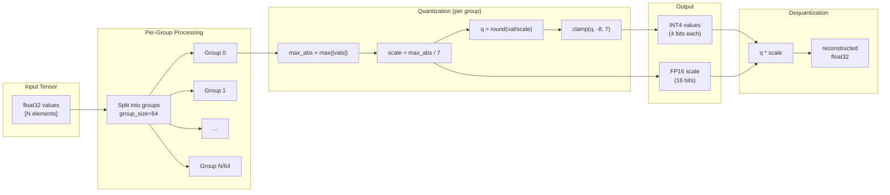

# Data Flow Diagram: KV Cache Compression Pipeline

## Overview
This diagram shows how KV cache data flows through the validation system, from model inference through compression to quality validation.

## Complete Validation Flow



## INT4 Quantization Detail



## Data Flow Steps

| Step | Input | Process | Output |
|------|-------|---------|--------|
| 1 | Prompt text | Tokenization | Token IDs |
| 2 | Token IDs | Model forward pass | DynamicCache |
| 3 | DynamicCache | Extract key/value tensors | PyTorch tensors |
| 4 | Tensors (bfloat16/float16) | Convert to float32 | float32 tensors |
| 5 | float32 tensors | safetensors.save_file() | .safetensors file |
| 6 | .safetensors | Go ReadFile() | Go tensor structs |
| 7 | Go tensors | Per-group quantization | INT4 + scales |
| 8 | INT4 + scales | Dequantization | Reconstructed float32 |
| 9 | Original + reconstructed | Quality metrics | RMSE, SNR, CosSim |
| 10 | Reconstructed | Go WriteFile() | compressed.safetensors |
| 11 | Metrics | JSON encode | stdout JSON |
| 12 | JSON output | Python parse | CompressionMetrics |
| 13 | CompressionMetrics | Threshold check | PASS/FAIL |

## Data Transformations

### Tensor Shapes (TinyLLaMA)
```
Original KV Cache per layer:
  Key:   [1, 4, seq_len, 64]  # batch=1, kv_heads=4, head_dim=64
  Value: [1, 4, seq_len, 64]

Total for 22 layers:
  Keys:   22 * 4 * seq_len * 64 elements
  Values: 22 * 4 * seq_len * 64 elements

Example (seq_len=128):
  Total elements: 22 * 2 * 4 * 128 * 64 = 1,409,024
  Original size (FP16): 2.75 MB
  Compressed size (INT4 + scales): ~0.73 MB
  Compression ratio: ~3.76x
```

### Precision Conversions
| From | To | Method |
|------|-----|--------|
| bfloat16 | float32 | `tensor.float()` in Python |
| float32 | FP16 bytes | `Float32ToFP16()` in Go |
| FP16 bytes | float32 | `FP16ToFloat32()` in Go |
| float32 | INT4 | Symmetric quantization |
| INT4 | float32 | `q * scale` |
