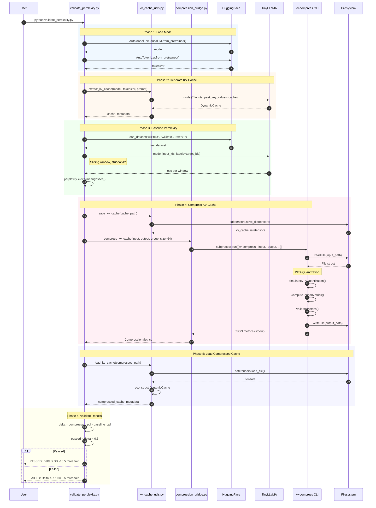
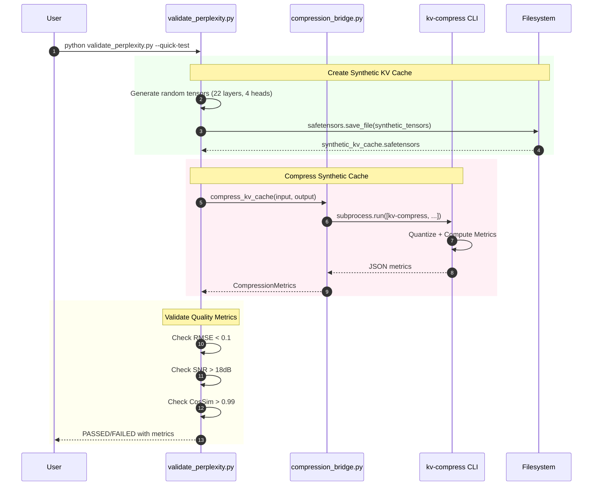
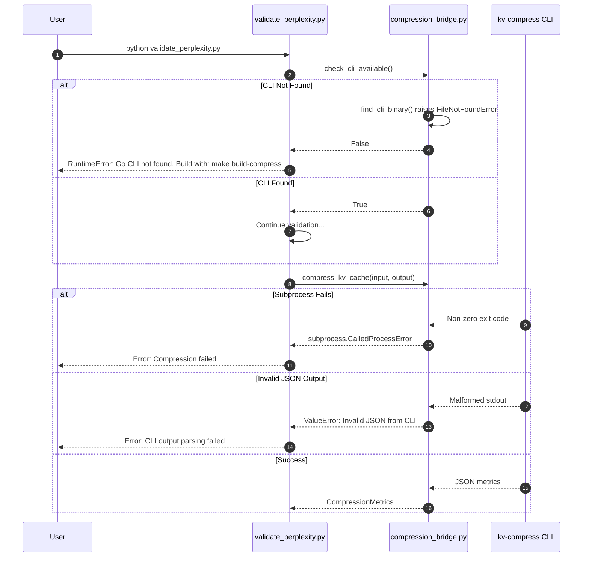

# Sequence Diagram: Full Validation Workflow

## Overview
This diagram shows the complete sequence of operations for validating KV cache compression quality using TinyLLaMA.

## Full Validation Sequence

## Quick Test Sequence (Synthetic Data)

## Error Handling Sequence

## Steps Summary

| Step | Actor | Action | Description |
|------|-------|--------|-------------|
| 1 | User | Run script | Execute `python validate_perplexity.py` |
| 2 | Main | Load model | Download/cache TinyLLaMA from HuggingFace |
| 3 | KVUtils | Extract cache | Run forward pass with DynamicCache |
| 4 | Main | Baseline PPL | Compute perplexity on WikiText-2 |
| 5 | KVUtils | Save cache | Write safetensors file |
| 6 | Bridge | Invoke CLI | Run `kv-compress` subprocess |
| 7 | CLI | Quantize | Apply INT4 per-group quantization |
| 8 | CLI | Metrics | Compute RMSE, SNR, cosine similarity |
| 9 | CLI | Write output | Save compressed safetensors |
| 10 | Bridge | Parse JSON | Extract CompressionMetrics |
| 11 | Main | Validate | Check delta < threshold |
| 12 | User | View result | PASSED/FAILED with metrics |
